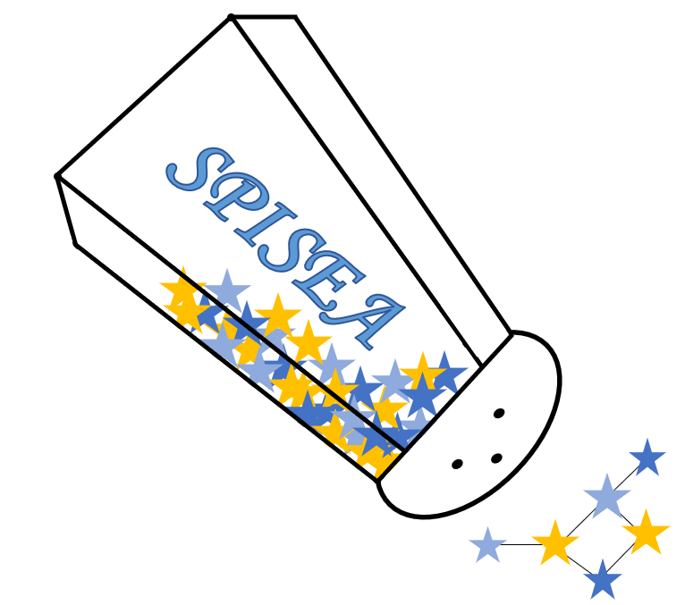

    

# SPISEA: Stellar Population Interface for Stellar Evolution and Atmospheres

SPISEA is an python package that generates single-age, single-metallicity
populations (i.e. star clusters). It gives the user control over many parameters:

* Cluster characteristics (age, metallicity, mass, distance)
* Total extinction, differential extinction, and extinction law
* Stellar evolution and atmosphere models
* Stellar multiplicity and Initial Mass Function
* Initial-Final Mass Relation
* Photometric filters

Here is a brief list of things that SPISEA can do:

* make a cluster isochrone in many filters using different stellar models
* make a star cluster at any age with an unusual IMF and unresolved multiplicity
* make a spectrum of a star cluster in integrated light

See [documentation](https://spisea.readthedocs.io/en/latest/) for details on 
[installing](https://spisea.readthedocs.io/en/latest/getting_started.html)
and running SPISEA. We also provide jupyter notebooks with a 
[quick-start tutorial](https://github.com/astropy/SPISEA/blob/main/docs/Quick_Start_Make_Cluster.ipynb)
and [additional examples](https://github.com/astropy/SPISEA/tree/main/docs/paper_examples)
demonstrating how to use SPISEA. 

## Version Update
Version 1 of this software package was called PyPopStar. Due to a naming conflict,
we have renamed the package of SPISEA for version 2 and beyond.
For reference, v2.0.0 has the same functionality as v1.0.1.

Instructions for updating from version 1 to version 2 are provided in
the documentation [here](https://spisea.readthedocs.io/en/latest/version_switch.html#version).

## Contributions
We encourage contributions to SPISEA, particularly those that add support for star formation histories, new models, higher spectral resolution, etc. For feature additions, we ask that users fork or branch off of the development repository, make their changes, and then submit merge and pull requests.

## License
This project is Copyright (c) Matthew Hosek Jr., Jessica Lu, Casey
Lam, Abhimat Gautam, Kelly Lockhart, Dongwon Kim, and Siyao Jia and licensed under
the terms of the GNU GPL v3+ license. This package is based upon
the [Astropy package template](https://github.com/astropy/package-template)
which is licensed under the BSD 3-clause license. See the licenses folder for
more information. This program is distributed in the hope that it will
be useful, but WITHOUT ANY WARRANTY;
without even the implied warranty of MERCHANTABILITY or FITNESS FOR A
PARTICULAR PURPOSE.  
