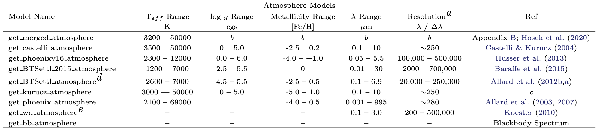

.. _atmo_models:

========================================
Atmosphere Model Object
========================================
Stellar atmosphere models are defined as functions in
``popstar/atmospheres.py``. These can be called by::

 from popstar import atmospheres
 atmo = atmospheres.<function_name>

To call an atmosphere for a particular star, user must define the
metallicity ([Z]), temperature (in K), and gravity (in cgs)::

  spectrum = atmo(metallicity=0, temperature=5800, gravity=4)
  wave = spectrum.wave # Wavelength in Angstroms
  flux = spectrum.flux # Flux in ergs s^-1 cm^-2 Angstrom^-1
  (pysynphot Flam units)

The atmosphere function is an input for the :ref:`isochrone_objects`,
and will automatically be used to define the
spectrum of each star in the isochrone model.

PopStar uses the pysynphot framework to extract the model atmosphere,
and the the output spectrum is a `pysynphot.Icat object <https://pysynphot.readthedocs.io/en/latest/ref_api.html#pysynphot.catalog.Icat>`_.

Below is a table of atmosphere model grids currently supported by
SPISEA. Note that the resolution column reports the original
resolution of the atmosphere model grid. These are available in the
`spisea_cdbs_highres.tar.gz` file on the installation page. However, the default grid SPISEA
uses has degraded the resolution of all atmosphere grids to R = 250
(the `spisea_cdbs.tar.gz` file). 

Model Atmosphere Classes
-------------------------
.. autofunction:: atmospheres.get_merged_atmosphere

.. autofunction:: atmospheres.get_wd_atmosphere

.. autofunction:: atmospheres.get_bb_atmosphere
   
.. autofunction:: atmospheres.get_castelli_atmosphere

.. autofunction:: atmospheres.get_phoenixv16_atmosphere
		  
.. autofunction:: atmospheres.get_BTSettl_2015_atmosphere
		  
.. autofunction:: atmospheres.get_BTSettl_atmosphere
		 
.. autofunction:: atmospheres.get_wdKoester_atmosphere

.. autofunction:: atmospheres.get_kurucz_atmosphere

.. autofunction:: atmospheres.get_phoenix_atmosphere

