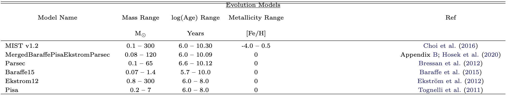

.. _evo_models:

========================================
Evolution Model Object
========================================

Stellar evolution models are defined as classes in
``spisea/evolution.py``. These can be called by::

  from spisea import evolution
  evo = evolution.<model_name>()

The evolution object is an input for the :ref:`isochrone_objects`. 
  
Below is a table of the evolution model grids currently supported by SPISEA.

Please note the stellar mass, age, and metallicity range of the evolution
model grid you choose. If you require other evolution models or need to
expand the existing grids, please see
:ref:`add_evo_models`. 

Base Evolution Model Class
------------------------------------
.. autoclass:: evolution.StellarEvolution
	       :members:
 
Specific Evolution Model Classes
--------------------------------------
.. autoclass:: evolution.MISTv1
	       :show-inheritance:

.. autoclass:: evolution.MergedBaraffePisaEkstromParsec
	       :show-inheritance:
		  
.. autoclass:: evolution.MergedPisaEkstromParsec
	       :show-inheritance:	       
		  
.. autoclass:: evolution.Baraffe15
	       :show-inheritance:
		  
.. autoclass:: evolution.Ekstrom12
	       :show-inheritance:
		  
.. autoclass:: evolution.Parsec
	       :show-inheritance:	       

.. autoclass:: evolution.Pisa
	       :show-inheritance:
   
