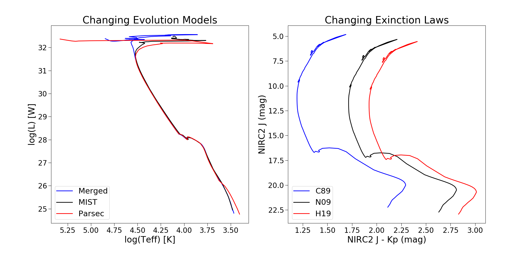
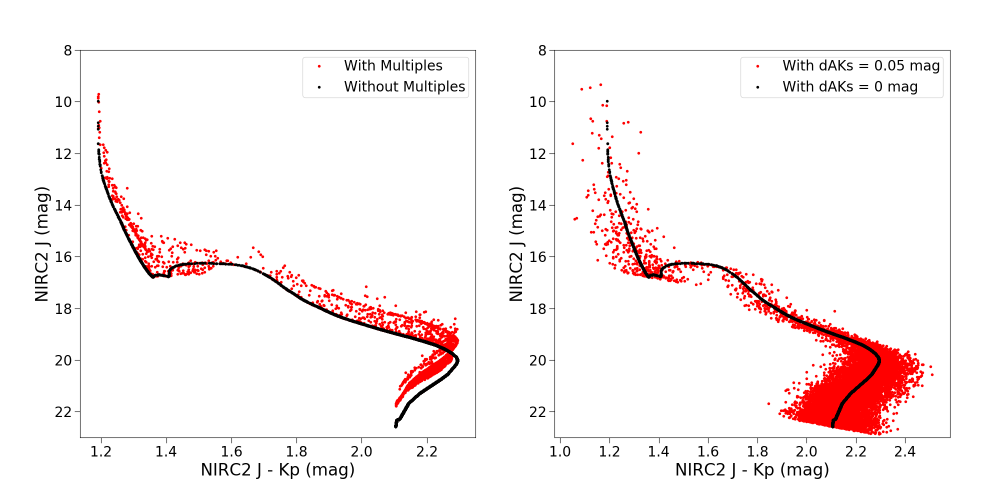
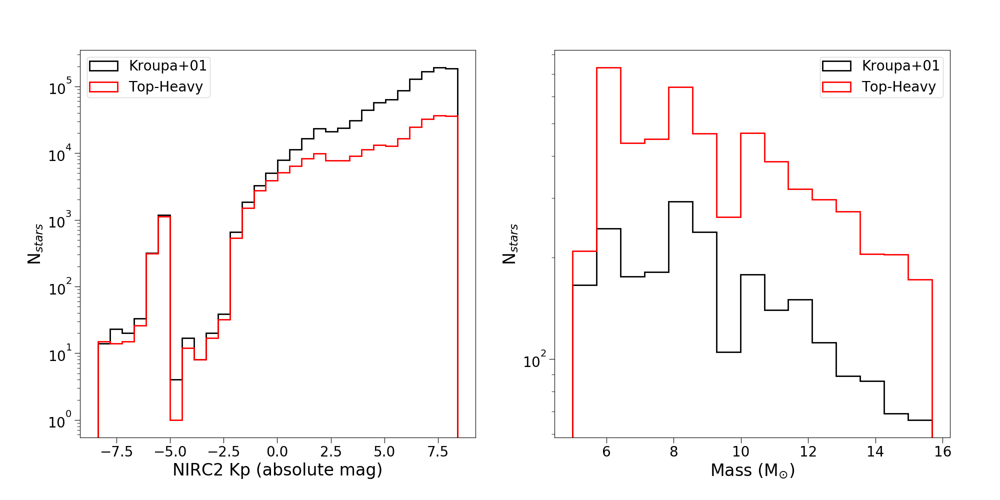
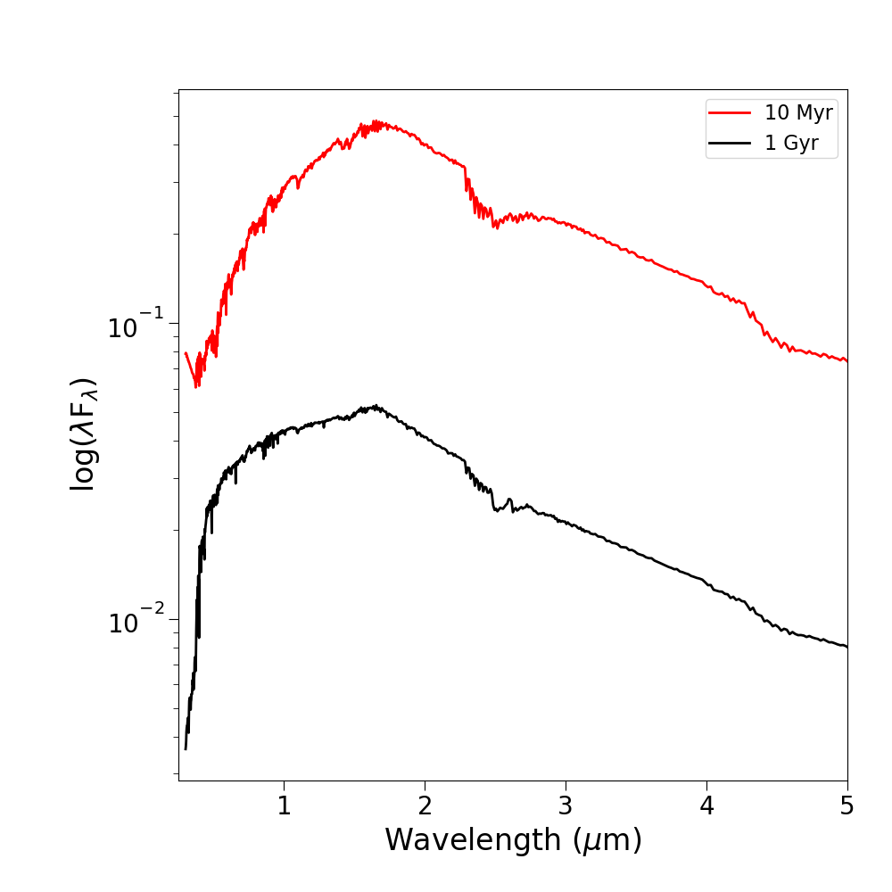

.. _further_examples:

===================
Further Examples
===================
Additional Jupyter notebooks with tutorials to produce the plots shown
in the PyPopStar paper (Hosek et al., in prep) can be found `here
<https://github.com/astropy/PyPopStar/tree/master/docs/paper_examples>`_.

Figure 2: HR-Diagrams with Different Evolution Models; CMDs with different Extinction Laws
--------------------------------------------------------------------------------------------------------

Figure 3: CMDs in Different Filters at Different Metallicities
----------------------------------------------------------------------------
.. figure:: images/iso_cmd_example.png
	    :align: center

Figure 4: Clusters with Multiplicity vs. Differential Extinction
--------------------------------------------------------------------

Figure 5: Clusters with Different IMFs: Luminosity Function + BH Mass Function
--------------------------------------------------------------------------------------------------------------------

Figure 7: Unresolved Cluster Spectra at Different Ages
----------------------------------------------------------

