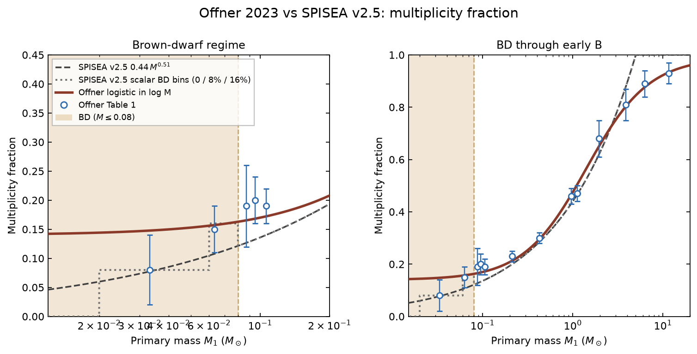
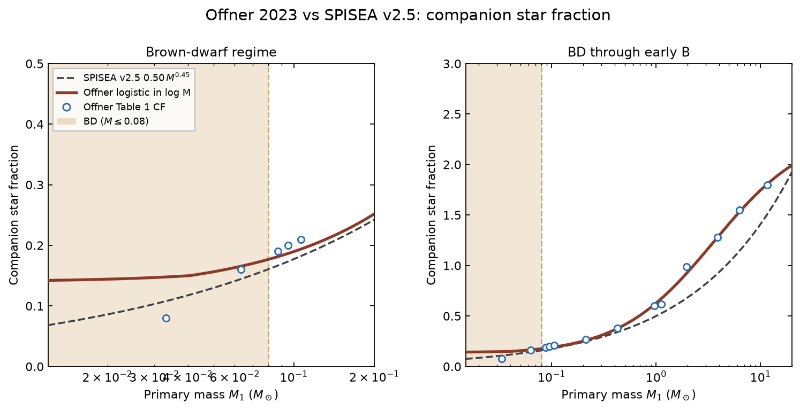
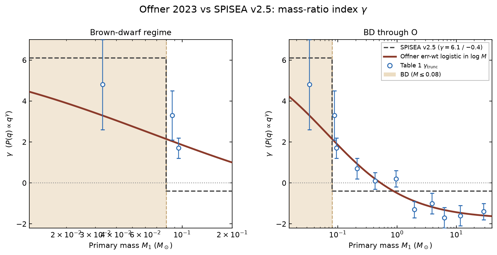
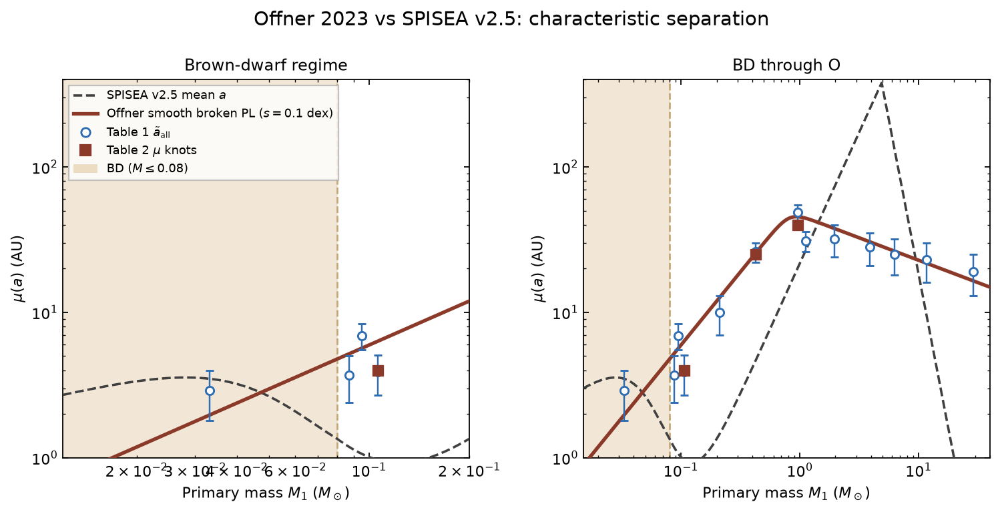
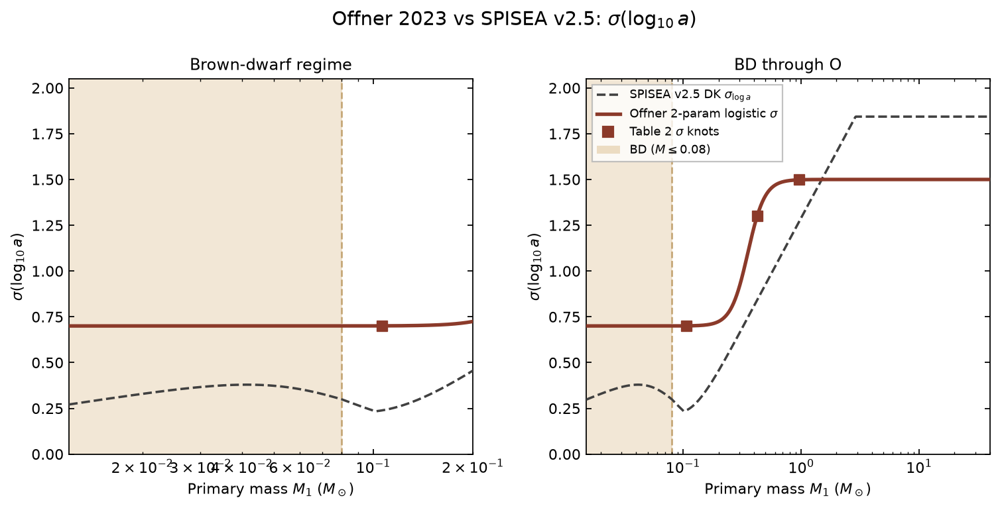

.. _multi_obj:

===========================
Stellar Multiplicity Object
===========================
The properties of multiple systems in the stellar population is
defined by the stellar multiplicity object. The multiplicity classes
are defined in ``spisea/imf/multiplicity.py``.

To call a multiplicity class and wire it into a cluster::

  from spisea.imf import imf, multiplicity
  from spisea import synthetic

  multi = multiplicity.<class_name>(...)
  imf_obj = imf.Kroupa_2001(multiplicity=multi)
  cluster = synthetic.ResolvedCluster(iso, imf_obj, Mcl)

The multiplicity object provides the following functions used by the IMF:

* ``multiplicity_fraction(mass)``
* ``companion_star_fraction(mass)``
* ``draw_q(mass, rng=None, n_comp=1)`` — companion mass ratios
  from ``q_power_at_mass``. ``random_q`` is deprecated.
* ``random_companion_count(x, CSF, MF, mass=None, rng=None)`` —
  companion-count draw. If ``companion_max`` is True, counts are
  capped at ``CSF_max`` at all masses.
* attributes ``companion_max``, ``CSF_max``, ``q_min``

The user can choose either
an unresolved or a resolved multiplicity object. If a resolved
multiplicity object is selected, then orbital parameters are
assigned to each companion star (e.g semi-major axis, eccentricity,
inclination). These values are added as additional columns in the ``companions``
table off of the cluster object.

Note that the synthetic photometry
returned in the ``star_systems`` table off the cluster object is the
same for both unresolved and resolved multiplicity classes: it
represents the combined photometry of all stars within a given system.

For most selected evolution models, the companions are evolved as single stars.
To evolve binaries with mass exchange (does not support triples and higher order multiples), 
you should use one of the ``MultiplicityResolved`` classes
and the ``COSMIC`` evolution model. 
See the example jupyter notebook `Cluster_w_COSMIC.ipynb <https://github.com/MovingUniverseLab/spisea/blob/main/docs/Cluster_w_COSMIC.ipynb>`_ for an example.
Note that currently COSMIC, due to being external evolution is significantly slower (2-10x) than the other evolution options.

The default is the SPISEA v2.5
:class:`~imf.multiplicity.MultiplicityUnresolved` /
:class:`~imf.multiplicity.MultiplicityResolvedDK` pair. Offner et al.
2023 is opt-in; see those class docstrings.

Unresolved Multiplicity Classes
------------------------------------------
.. autoclass:: imf.multiplicity.MultiplicityUnresolved
	       :show-inheritance:
	       :members: companion_star_fraction,
			 multiplicity_fraction, draw_q,
			 q_power_at_mass, random_companion_count

.. autoclass:: imf.multiplicity.MultiplicityPiecewisePowerLaw
	       :show-inheritance:
	       :members: multiplicity_fraction, companion_star_fraction

.. autoclass:: imf.multiplicity.MultiplicityLogistic
	       :show-inheritance:
	       :members: multiplicity_fraction, companion_star_fraction

.. autoclass:: imf.multiplicity.MultiplicityUnresolvedOffner2023
	       :show-inheritance:
	       :members: multiplicity_fraction, companion_star_fraction,
			 q_power_at_mass, draw_q, log_a_mean, a_mean,
			 sigma_log_a

Resolved Multiplicity Classes
------------------------------------------
.. autoclass:: imf.multiplicity.MultiplicityResolvedDK
	       :show-inheritance:
	       :members: log_semimajoraxis, log_a_mean, a_mean, sigma_log_a

.. autoclass:: imf.multiplicity.MultiplicityResolvedOffner2023
	       :show-inheritance:
	       :members: log_semimajoraxis, log_a_mean, a_mean, sigma_log_a

Comparison figures
------------------------------------------
Offner 2023 vs SPISEA v2.5. Model details are on the class
docstrings above.

   Offner 2023 vs SPISEA v2.5: multiplicity fraction vs primary mass.

   Offner 2023 vs SPISEA v2.5: companion star fraction vs primary mass.

   Offner 2023 vs SPISEA v2.5: mass-ratio index :math:`\gamma` vs primary mass.

.. figure:: figures/meanq_offner_vs_spisea2.5.png
   :alt: Offner 2023 vs SPISEA v2.5: mean mass ratio vs primary mass
   :align: center

   Offner 2023 vs SPISEA v2.5: mean mass ratio :math:`\langle q \rangle` vs primary mass.

   Offner 2023 vs SPISEA v2.5: characteristic :math:`\mu(a)` vs primary mass.

   Offner 2023 vs SPISEA v2.5: :math:`\sigma(\log_{10} a)` vs primary mass.

From the repository root::

   python docs/figures/plot_mf_offner_vs_spisea2.5.py
   python docs/figures/plot_csf_offner_vs_spisea2.5.py
   python docs/figures/plot_q_offner_vs_spisea2.5.py
   python docs/figures/plot_meanq_offner_vs_spisea2.5.py
   python docs/figures/plot_sep_offner_vs_spisea2.5.py
   python docs/figures/plot_sig_loga_offner_vs_spisea2.5.py

``python docs/figures/plot_q_sep_offner_vs_spisea2.5.py`` writes the
last four PNGs.
