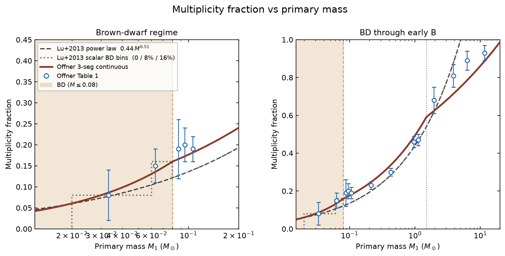
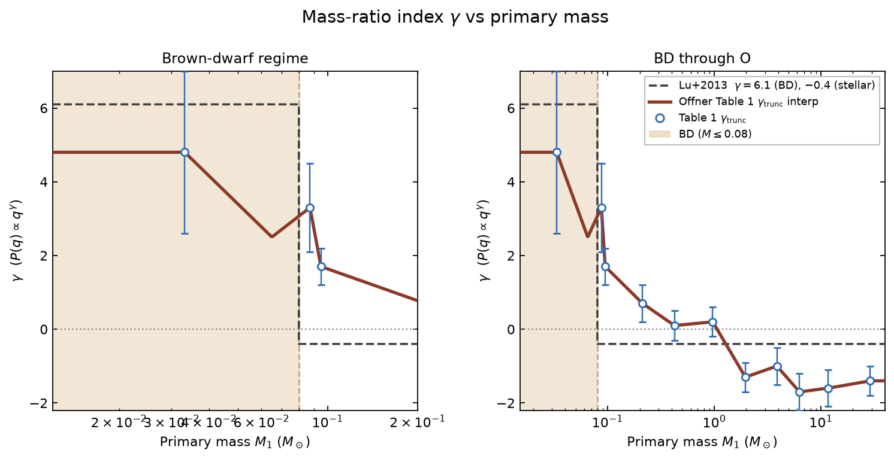
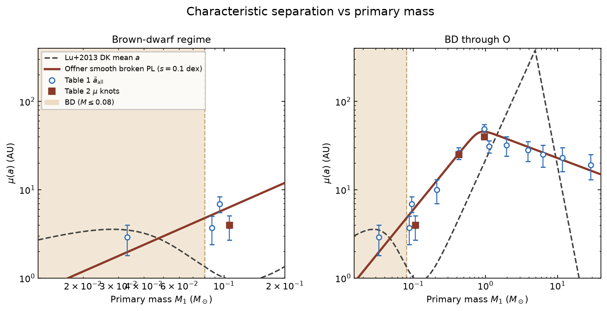
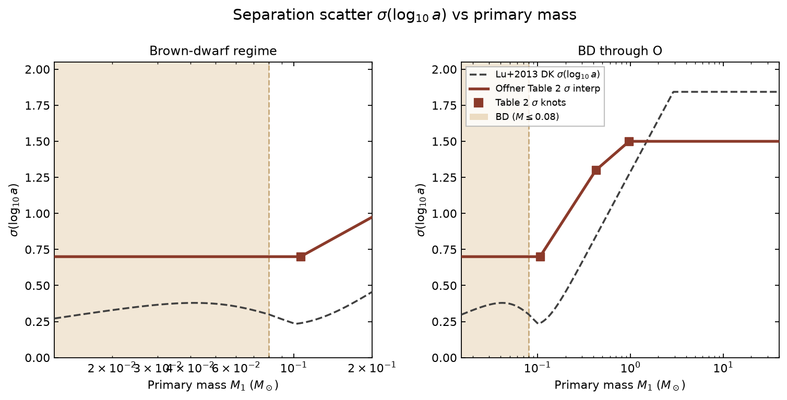
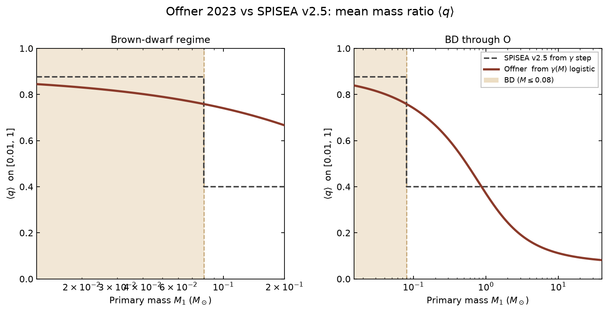

.. _multi_obj:

===========================
Stellar Multiplicity Object
===========================
The properties of multiple systems in the stellar population is
defined by the stellar multiplicity object. The multiplicity classes
are defined in ``spisea/imf/multiplicity.py``.

To call a multiplicity class and wire it into a cluster::

  from spisea.imf import imf, multiplicity
  from spisea import synthetic

  multi = multiplicity.<class_name>(...)
  imf_obj = imf.Kroupa_2001(multiplicity=multi)
  cluster = synthetic.ResolvedCluster(iso, imf_obj, Mcl)

Companion masses and whether a primary is multiple are drawn in
``IMF.generate_cluster`` / ``IMF.calc_multi``, which call the multiplicity
object. ``synthetic.py`` does not draw companions: it labels brown-dwarf
evolutionary phase=90 so they photometrize, combines system photometry,
and (for resolved classes) fills orbital columns.

Duck-typed multiplicity contract used by the IMF:

* ``multiplicity_fraction(mass)``
* ``companion_star_fraction(mass)``
* ``random_q(x, mass=None)`` — pass ``mass`` for mass-dependent q
  (brown-dwarf vs stellar). ``random_q(x)`` with no mass keeps the
  historical stellar-only power law.
* ``random_companion_count(x, CSF, MF, mass=None, rng=None)`` —
  companion-count policy, including the binaries-only BD cap when
  ``mass`` is given.
* attributes ``companion_max``, ``CSF_max``, ``q_min``

Resolved classes are duck-typed in ``synthetic.py`` on
``log_semimajoraxis``, ``random_e``, and ``random_keplarian_parameters``.
They do not need to subclass :class:`~imf.multiplicity.MultiplicityResolvedDK`.

The multiplicity object is an input for the :ref:`imf_objects`, as it
impacts how the stellar masses are drawn.

The user can choose either
an unresolved or a resolved multiplicity object. If a resolved
multiplicity object is selected, then orbital parameters are
assigned to each companion star (e.g semi-major axis, eccentricity,
inclination). These values are added as additional columns in the ``companions``
table off of the cluster object.

Note that the synthetic photometry
returned in the ``star_systems`` table off the cluster object is the
same for both unresolved and resolved multiplicity classes: it
represents the combined photometry of all stars within a given system.

For most selected evolution models, the multiples are evolved as single stars.
To evolve binaries (does not support higher order multiples), you should use one of the ``MultiplicityResolved`` classes
and the ``COSMIC`` evolution model. 
See the example jupyter notebook `Cluster_w_COSMIC.ipynb <https://github.com/MovingUniverseLab/spisea/blob/main/docs/Cluster_w_COSMIC.ipynb>`_ for an example.
Note that currently COSMIC due to being external evolution is significantly slower than the other evolution options.

Unresolved Multiplicity Classes
------------------------------------------
.. autoclass:: imf.multiplicity.MultiplicityUnresolved
	       :members: companion_star_fraction,
			 multiplicity_fraction, random_q

.. autoclass:: imf.multiplicity.MultiplicityPiecewisePowerLaw
	       :show-inheritance:
	       :members: multiplicity_fraction, companion_star_fraction

.. autoclass:: imf.multiplicity.MultiplicityLogistic
	       :show-inheritance:
	       :members: multiplicity_fraction, companion_star_fraction

.. autoclass:: imf.multiplicity.MultiplicityUnresolvedOffner2023
	       :show-inheritance:
	       :members: multiplicity_fraction, companion_star_fraction,
			 q_power_at_mass, random_q

The Lu et al. (2013) :class:`~imf.multiplicity.MultiplicityUnresolved`
object remains the default. Offner et al. 2023 is **opt-in**::

  from spisea.imf import imf, multiplicity
  from spisea import synthetic

  multi = multiplicity.MultiplicityUnresolvedOffner2023()
  # or the alias:
  # multi = multiplicity.MultiplicityOffner2023()
  imf_obj = imf.Kroupa_2001(multiplicity=multi)
  cluster = synthetic.ResolvedCluster(iso, imf_obj, Mcl)

MF vs primary mass (Lu et al. 2013 array power law and scalar BD staircase
compared to the Offner logistic in log-mass and Table 1 points):

   Left: brown-dwarf zoom. Right: BD through early B. The Offner model is a
   4-parameter logistic in log-mass fitted to Table 1, C-infinity smooth
   and saturating at B ~ 1. The shaded region is below the hydrogen-burning
   limit (0.08 solar masses). Reproduce with
   ``python docs/figures/plot_mf_offner_vs_lu2013.py``.

Mass-ratio index vs primary mass (Offner interpolates Table 1
:math:`\gamma_\mathrm{trunc}`; Lu+2013 is a step: 6.1 below 0.08 solar
masses, :math:`-0.4` above):

   Left: brown-dwarf zoom. Right: BD through O. Offner BD companions are
   more equal-mass than Lu’s stellar :math:`q` power. Reproduce with
   ``python docs/figures/plot_q_sep_offner_vs_lu2013.py``.

Characteristic separation vs primary mass (Offner interpolates Table 1
:math:`\tilde{a}_\mathrm{all}` and Table 2 :math:`\mu`; Lu+2013 is the
Duchêne–Kraus broken power law with a brown-dwarf blend):

   Open circles are Table 1 :math:`\tilde{a}_\mathrm{all}`; filled squares
   are Table 2 :math:`\mu` knots (4, 25, 40 au). Offner BD binaries peak
   at a few AU. Same script.

Separation scatter vs primary mass (Offner uses Table 2
:math:`\sigma` of 0.7 / 1.3 / 1.5, held at 0.7 for brown dwarfs;
Lu+2013 DK is a linear fit in log mass that saturates above 2.9 solar
masses):

   Left: brown-dwarf zoom. Right: BD through O. Filled squares are the
   Table 2 knots. The Lu dip near 0.08 solar masses is the BD/stellar
   blend. Same script.

Mean mass ratio on :math:`0.01 \leq q \leq 1` from :math:`P(q)\propto q^{\gamma}`:

   Companion to the :math:`\gamma` panel. Same script.

Figure generators live at ``docs/figures/plot_mf_offner_vs_lu2013.py``
and ``docs/figures/plot_q_sep_offner_vs_lu2013.py``.

Resolved Multiplicity Classes
------------------------------------------
.. autoclass:: imf.multiplicity.MultiplicityResolvedDK
	       :show-inheritance:

.. autoclass:: imf.multiplicity.MultiplicityResolvedOffner2023
	       :show-inheritance:
	       :members: log_semimajoraxis

