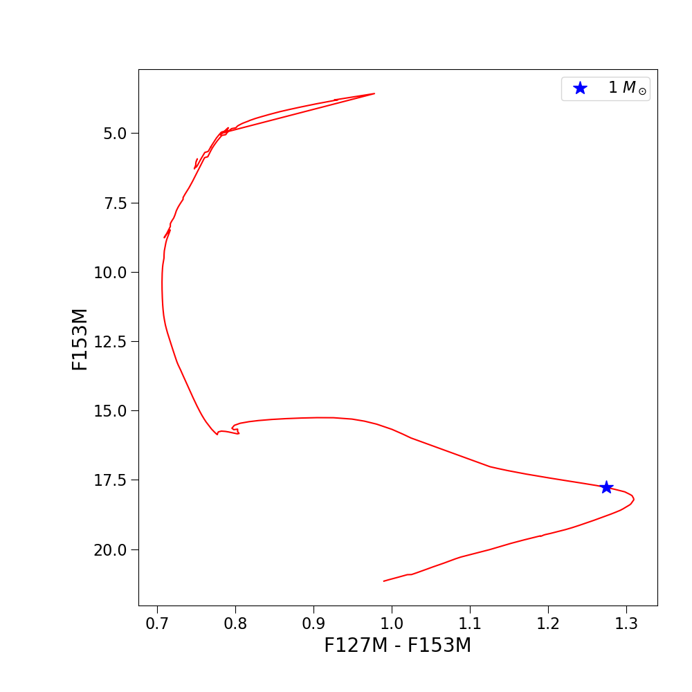
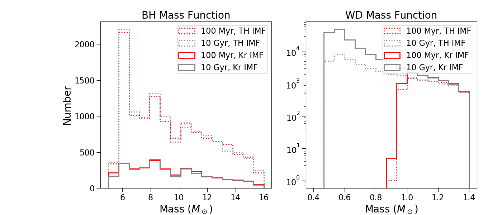

.. _quick_start:

===================
Quick Start Guide
===================

We provide a `jupyter notebook
<https://github.com/astropy/SPISEA/blob/main/docs/Quick_Start_Make_Cluster.ipynb>`_
as a Quick-Start Guide to demonstrate the steps required to simulate a cluster and interact
with the resulting output. This guide shows you how to:

Make a Cluster Isochrone
----------------------------------
You will construct a cluster isochrone, setting the age, distance,
extinction, and metallicity, as well as the stellar evolution and
atmosphere models and reddening law. Photometry will be calculated in
several HST filters, and you will construct a color-magnitude diagram,
identifying the position of a 1 solar-mass star.

Make a Simulated Cluster with Multiplicity
-----------------------------------------------------------
You will use the isochrone you generated to make a simulated
cluster. Additional parameters you will set include the stellar
multiplicity, IMF, and overall cluster mass. You will make a
color-magnitude diagram of the cluster, and compare it to the base
isochrone. This shows the impact of stellar multiplicity on the
photometric properties of the stellar systems.

.. figure:: images/simulated_cluster_example.png
	    :align: center

Examine Compact Remnants Produced by Different Clusters
----------------------------------------------------------------
You will generate two massive clusters, one at 100 Myr and the other at 10
Gyr, and compare the distribution of compact remnants produced given
the IFMR IFMR_Raithel18. You will also test how
changing the IMF of these clusters changes these distributions.

